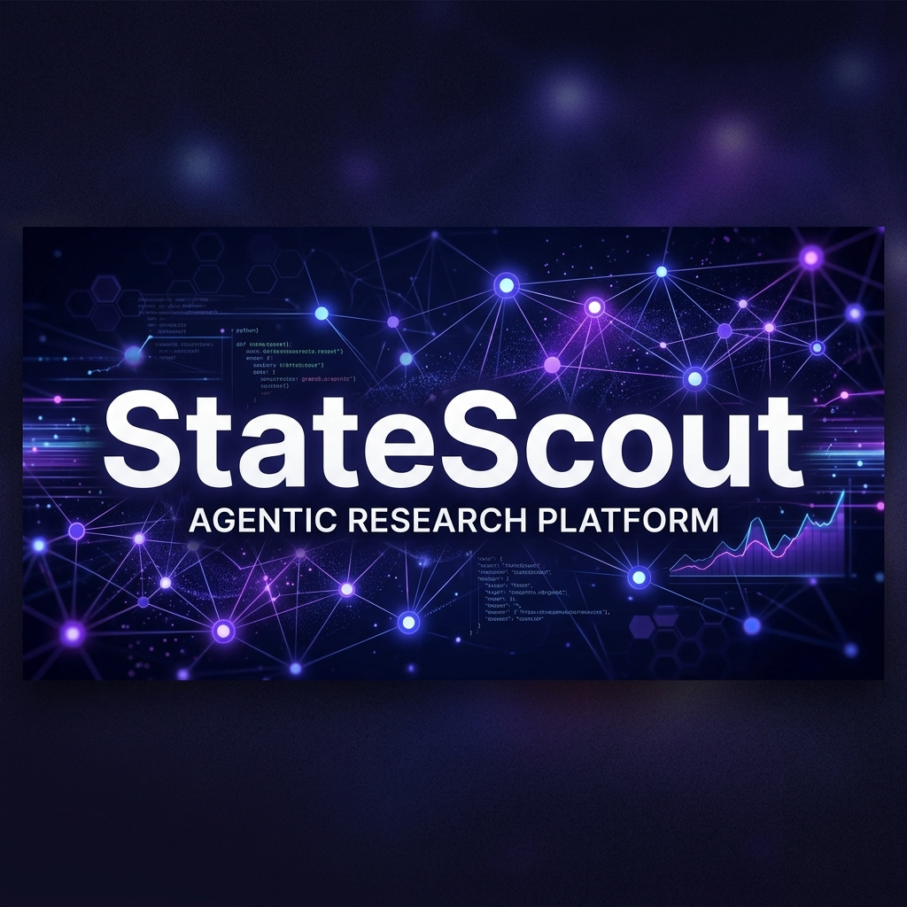
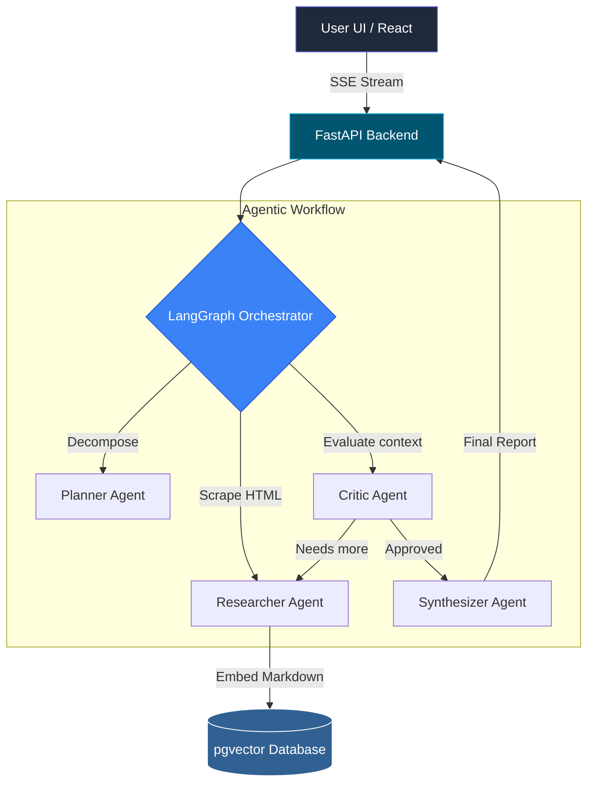

<div align="center">
  
</div>

<br/>

<div align="center">
  
  
  
  
  
  
</div>


**An autonomous, LangGraph-powered AI agent. Capable of real-time web scraping, semantic chunking, and streaming fully synthesized Markdown reports.**

StateScout is a production-grade, containerized AI Research platform designed to autonomously execute deep-dive research tasks. Given a topic, the agent decomposes the query, searches the web, structurally scrapes documentation, stores it in a vector database, and streams its exact "thought process" back to a modern React UI via Server-Sent Events.

---

## 🚀 Key Features

- **Autonomous Orchestration:** Utilizes **LangGraph** to manage a multi-actor state machine (Planner, Researcher, Critic, Synthesizer).
- **Real-Time Streaming:** Backend uses **FastAPI Server-Sent Events (SSE)** to stream LangGraph's internal state updates and final reports directly to the frontend.
- **Advanced RAG Pipeline:** Intelligent HTML parsing via `trafilatura`, layered with semantic Markdown and recursive chunking before embedded storage in **PostgreSQL (`pgvector`)**.
- **Model Agnostic:** Configured to rapidly swap models. Defaults to Llama 3.3 (Groq) for lightning-fast orchestration and Gemini 2.5 Flash for high-context synthesis.
- **Evaluated Performance:** Pipeline accuracy and retrieval effectiveness are quantitatively scored using the **RAGAS** evaluation framework.
- **"Bring Your Own Key" (BYOK) UI:** A beautiful, dark-mode Tailwind React frontend that allows users to seamlessly plug in their own LLM API keys when session credits run out.

---

## 🧠 Architecture & Tech Stack



### Backend Engine
- **Framework:** FastAPI running on Uvicorn.
- **Agent Orchestration:** LangGraph & LangChain.
- **LLMs:** Groq (`llama-3.3-70b-versatile`) & Google Generative AI (`gemini-2.5-flash`).
- **Web Scraping:** DuckDuckGo Search API + Trafilatura.

### Infrastructure & Data
- **Database:** PostgreSQL enriched with the `pgvector` extension.
- **Containerization:** Fully dockerized via `docker-compose`.

### Frontend Client
- **Framework:** React + Vite.
- **Styling:** Tailwind CSS v3 with dynamic micro-animations.
- **Rendering:** Custom `react-markdown` implementations for report synthesis.

---

## 🛠️ Getting Started

### Prerequisites
- Docker & Docker Compose
- Node.js v18+ (If running without Docker)
- LLM API Keys (Groq / Gemini)

### Option 1: Docker Deployment (Recommended)

1. **Setup & Configure:**
   ```bash
   cp .env.example .env
   # Add your GROQ_API_KEY and GEMINI_API_KEY
   ```

2. **Spin Up the Platform:**
   ```bash
   docker-compose up --build -d
   ```
   This automatically orchestrates the `pgvector` database, the FastAPI backend, and the Vite frontend.

3. **Access the App:**
   Navigate to `http://localhost:5174` in your browser.

### Option 2: Local Launch

**1. Start the Backend:**
```bash
cd backend
python3 -m venv venv
source venv/bin/activate
pip install -r requirements.txt
uvicorn app.main:app --host 0.0.0.0 --port 8001
```

**2. Start the Frontend:**
```bash
cd frontend
npm install
npm run dev -- --host --port 5174
```
*(Note: You must have a running instance of PostgreSQL with `pgvector` accessible via the `DATABASE_URL` in your `.env` for vector operations to succeed).*

---

## 📈 Evaluation

StateScout includes a rigorous evaluation suite utilizing **RAGAS** to grade the RAG pipeline on Faithfulness, Answer Relevancy, and Context Precision. 

To run the mock business data evaluation pipeline:
```bash
docker-compose exec backend python test_eval.py
```

---

## 📄 License

This project is licensed under the MIT License - see the [LICENSE](LICENSE) file for details.
